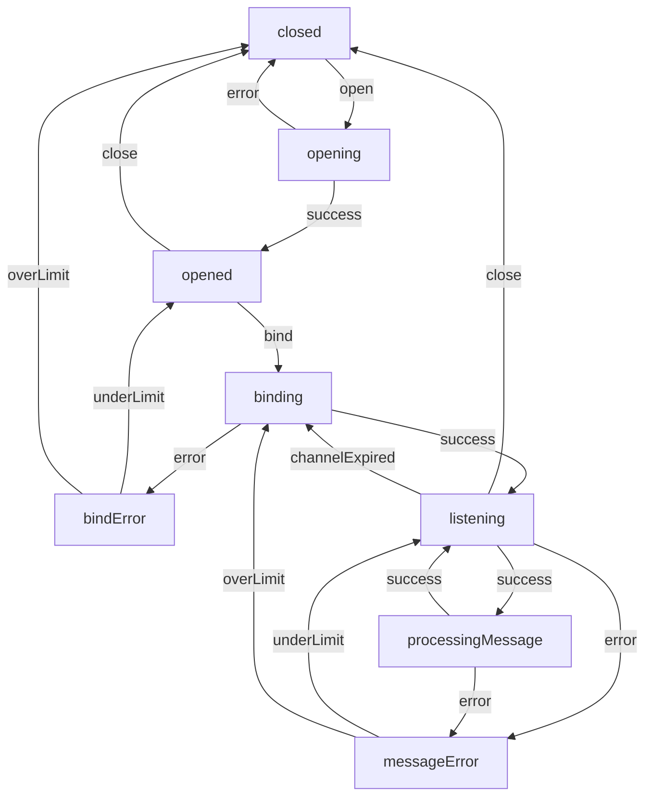
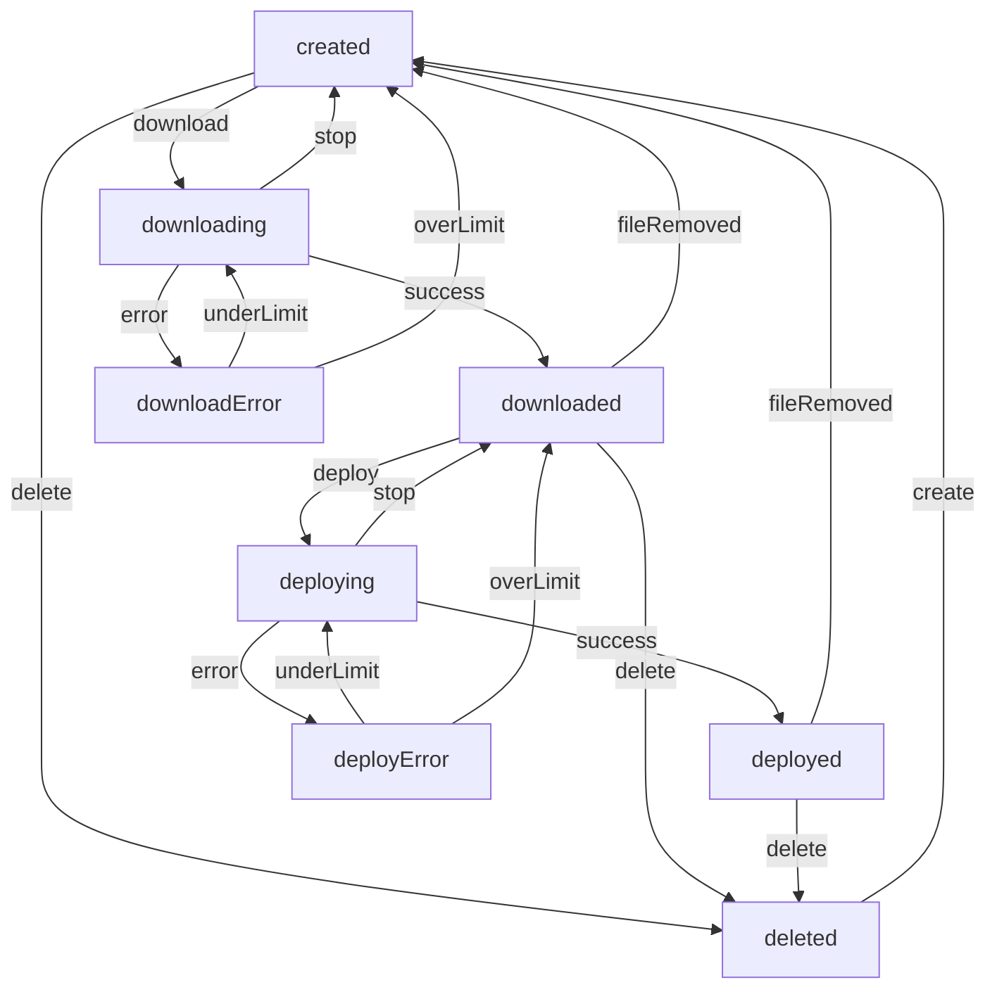

# Diagrams

The following diagrams can be opened with [Typora](https://typora.io)

## State Machine of Overlay



## Multi UDP-Packets Message

```sequence
Peer1->Peer2: TID,SendReq
Peer2-->Peer1: TID,SendReq,SendAck
Peer1->Peer2: TID,SendAck,TotalSequences
Peer2-->Peer1: TID,SendReady,TotalSequences
Peer1->Peer2: TID,DataPost,Sequence:1,SequencePayload
Peer1->Peer2: TID,DataPost,Sequence:2,SequencePayload
Peer1->Peer2: ...
Peer1->Peer2: TID,DataPost,Sequence:N,SequencePayload
Peer2-->Peer1: TID,DataError,MissingSequences:10,17
Peer1->Peer2: TID,DataPost,Sequence:10,SequencePayload
Peer1->Peer2: TID,DataPost,Sequence:7,SequencePayload
Peer2-->Peer1: TID,DataSuccess
```


## Update Lifecycle


