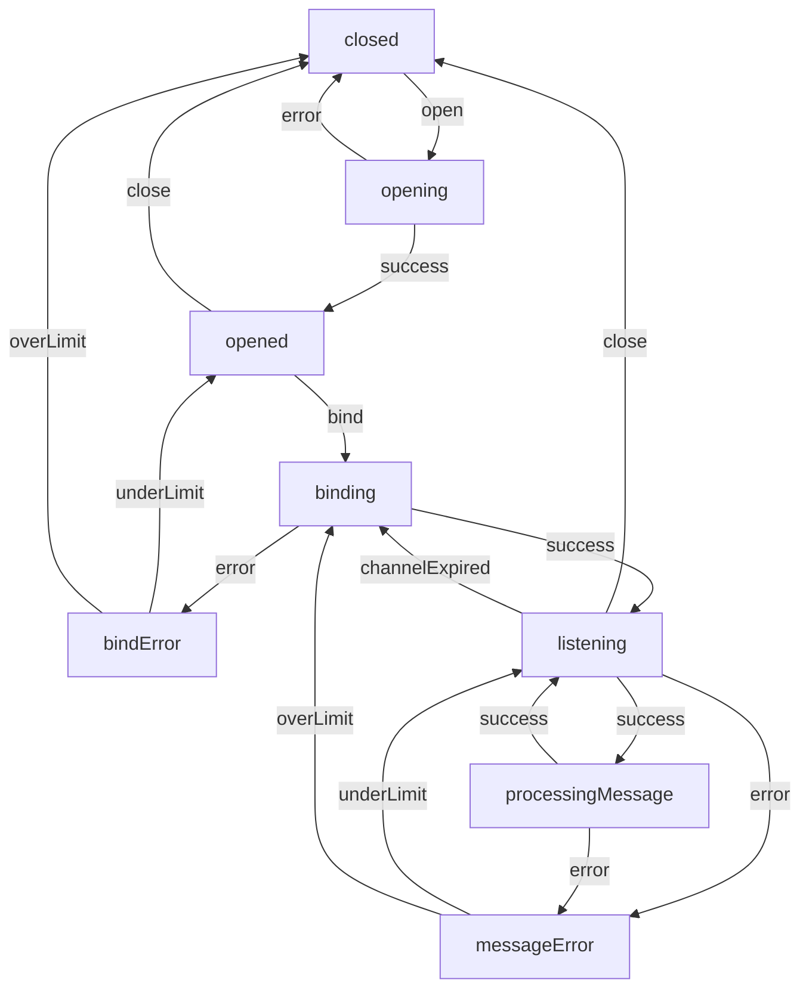

# State Machine of Overlay

```mermaid
graph TD;
	closed -->|open| opening;
	opening -->|success| opened;
	opening -->|error| closed;
	opened -->|close| closed;
	opened -->|bind| binding;
	binding -->|error| bindError;
	bindError -->|underLimit| opened;
	bindError -->|overLimit| closed;
	binding -->|success| listening;
	listening -->|close| closed;
	listening -->|success| processingMessage;
	listening -->|error| messageError;
	listening -->|channelExpired| binding;
	processingMessage -->|success| listening;
	processingMessage -->|error| messageError;
	messageError -->|underLimit| listening;
	messageError -->|overLimit| binding;
```

