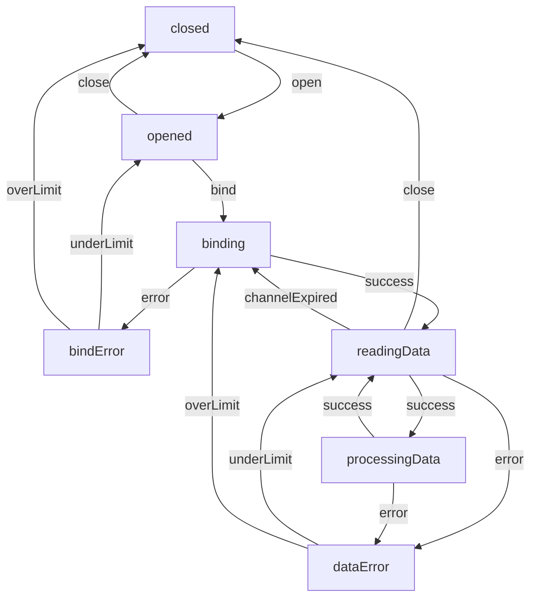

# State Machine of Overlay

```mermaid
graph TD;
	closed -->|open| opened;
	opened -->|close| closed;
	opened -->|bind| binding;
	binding -->|error| bindError;
	bindError -->|underLimit| opened;
	bindError -->|overLimit| closed;
	binding -->|success| readingData;
	readingData -->|close| closed;
	readingData -->|success| processingData;
	readingData -->|error| dataError;
	readingData -->|channelExpired| binding;
	processingData -->|success| readingData;
	processingData -->|error| dataError;
	dataError -->|underLimit| readingData;
	dataError -->|overLimit| binding;
```

